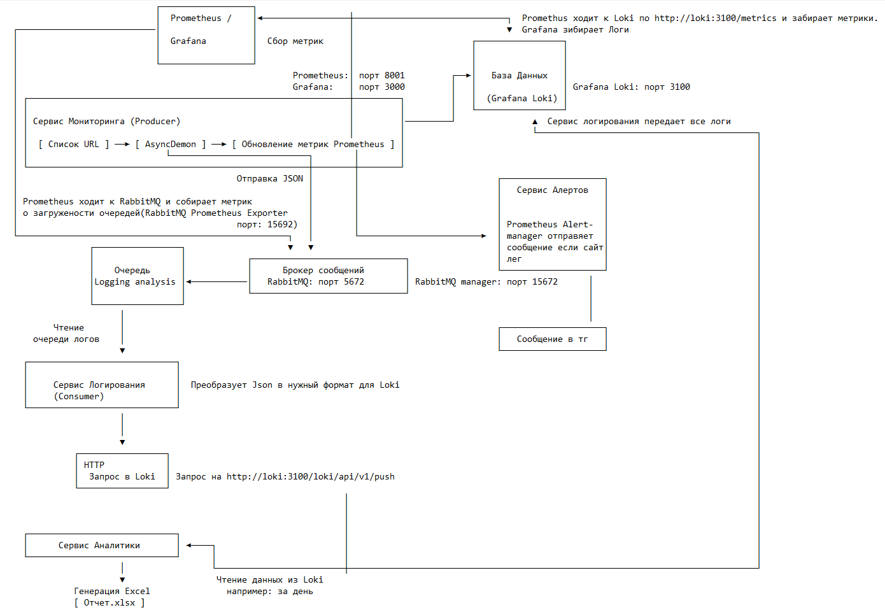

# DevOps проект: **Система асинхроного веб-мониторинга и анализа логов на Python** :snake:

## ***Стек технологий*** :computer:
1. **Python 3.12.11**
2. **FastApi**
3. **FastStream** для взаимодействия с брокером
3. **PLG**:
    * **Prometheus**
    * **Grafana Loki**
    * **Grafana**
4. **Брокер сообщений: RabbitMQ**
5. **Docker**
6. **Docker compose**

## ***Архитектура*** :house:

    

